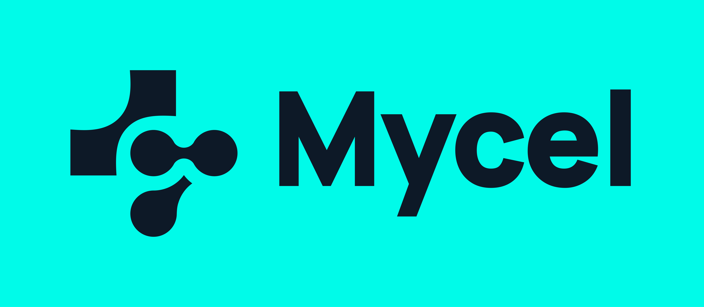

### *Cultivating Intelligent Transformation*

We grow **AI-native solutions** for research and innovation, businesses, and cities — for teams and individuals ready to make a real difference.

---

## What we build

<table>
<tr>
<td width="33%" align="center">

**🔬 Research & Innovation**

*Transform ideas to real impact*

Funding discovery · AI for scientific discovery · Connected research · Impact analytics

</td>
<td width="33%" align="center">

**🏢 Businesses**

*AI that works around the clock*

AI transformation · Custom AI agents · Capacity building · EU AI Act & GDPR readiness

</td>
<td width="33%" align="center">

**🏛️ Cities & Municipalities**

*Govern AI responsibly*

Smart city orchestration · Ethical AI governance · Policy simulation · Citizen engagement

</td>
</tr>
</table>

---

> *Like mycelia networks that connect forests underground, we build systems that link what matters.*  
> **Silently. Reliably. At scale.**

---

**Rooted in Germany · Growing globally**

[Let's talk](https://mycel-ai.de) · [Explore solutions](https://mycel-ai.de)

---

**Brand assets:** [Logo (light)](logo-light.png) · [Logo (dark)](logo-dark.png) · [Icon (light)](icon-light.png) · [Icon (dark)](icon-dark.png)

